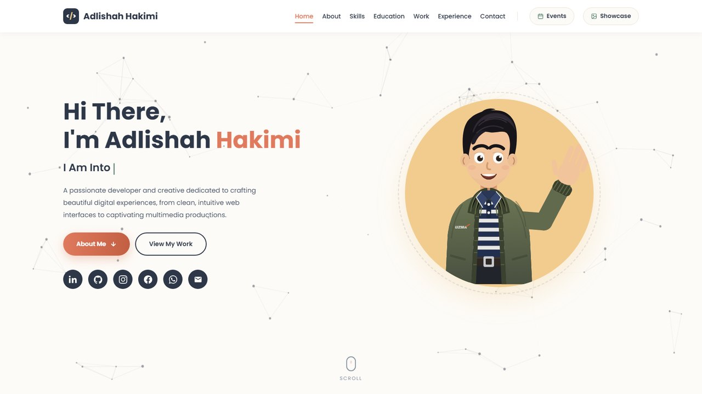

<div align="center">

# Adlishah Hakimi — Portfolio

**Web & mobile developer · WebGIS · multimedia**
Computer Science (Graphics & Multimedia Technology) graduate, UMPSA.

[](https://kymy07.github.io/MyPortfolio/)
[](https://pages.github.com/)
[]()

### 🔗 **[kymy07.github.io/MyPortfolio](https://kymy07.github.io/MyPortfolio/)**



</div>

---

## Overview

A personal portfolio built as a static site — plain HTML, CSS and JavaScript with
no framework and no build step. Clone it and open `index.html`, or push to `main`
and GitHub Pages serves it.

The visual identity is an **earthy warm palette** (cream, charcoal, terracotta, sage,
warm sand) carried across every page, with a hand-drawn SVG cartoon avatar in the hero.

---

## Features

| | |
|---|---|
| 🎨 **One design system** | Cream `#FDFBF7`, charcoal `#2D3748`, terracotta `#E07A5F`, sage `#81B29A`, warm sand `#F2CC8F` — driven by CSS custom properties |
| 🧑‍🎨 **Hand-drawn SVG avatar** | Built path-by-path; the eyes follow the cursor and the hand waves on a sine curve |
| ✨ **Animated hero** | Canvas particle network and a typewriter cycling eight disciplines |
| 🗂️ **Filterable showcase** | 27 projects across 7 categories with a video + slideshow lightbox |
| 📅 **Events page** | Exhibitions, competitions and CSR activities with multi-photo galleries |
| 📱 **Responsive** | Three breakpoints; nav collapses to a hamburger below 1050px |
| ♿ **Motion-aware** | Every animation stops under `prefers-reduced-motion` |
| ✉️ **Working contact form** | EmailJS, with inline validation and toast feedback |

---

## Pages

| File | Contents |
|---|---|
| `index.html` | Hero, About, Skills, Education, Work, Experience, Contact |
| `showcase.html` | Full project showcase — filterable grid + lightbox |
| `events.html` | Events & activities with photo galleries |
| `gallery.html` | Redirect kept for the old public URL → `showcase.html` |

---

## Tech Stack

**Frontend** — HTML5 · CSS3 (custom properties, grid, flexbox) · vanilla JavaScript (ES6+)
**Graphics** — inline SVG · Canvas 2D
**Fonts** — Poppins (Google Fonts)
**Services** — EmailJS
**Hosting** — GitHub Pages

No npm install, no bundler, no dependencies to audit.

---

## Project Structure

```
MyPortfolio/
├── index.html          # home — includes the inline SVG avatar
├── showcase.html       # project showcase + lightbox
├── events.html         # events & activities
├── gallery.html        # redirect → showcase.html
├── favicon.ico         # cartoon avatar, multi-size
├── favicon.png         # 512px master
├── apple-touch-icon.png
├── preview.jpg         # README banner
└── <project media>     # screenshots, slideshows and .mp4 walkthroughs
```

---

## Getting Started

```bash
git clone https://github.com/kymy07/MyPortfolio.git
cd MyPortfolio
python -m http.server 8000
```

Then open <http://127.0.0.1:8000/>.

> **Serve over HTTP, not `file://`.** The contact form and parts of the showcase
> behave differently when opened directly from the filesystem.

---

## Deployment

GitHub Pages serves the `main` branch from the repository root — push and the live
site updates on its own, usually within a minute or two.

```bash
git add -A
git commit -m "your message"
git push origin main
```

---

## Editing Guide

<details>
<summary><b>The cartoon avatar</b></summary>

Lives as an inline `<svg id="avatar">` in `index.html`. It has to be inline rather
than an external file because the script needs direct access to its nodes.

- **Eyes** — `.pupil` groups, offset toward the cursor on `mousemove`
- **Wave** — `#waveArm` and `#waveHand` rotate on a sine curve, so the swing is
  fastest through the middle and eases only at the turnarounds
- **Reduced motion** — both are skipped when the visitor asks for less motion

</details>

<details>
<summary><b>Adding a showcase item</b></summary>

Copy any `.masonry-item` block in `showcase.html`:

```html
<div class="masonry-item" data-cat="photography"
     data-pages="shot1.jpg|shot2.jpg"
     data-video="walkthrough.mp4"
     data-label="Project name"
     data-link="https://example.com"
     data-link-label="Visit Live Site">
```

- `data-cat` — filter category (`design`, `photography`, `events`, `campus`,
  `augmented reality`, `video`, `others`)
- `data-pages` — `|`-separated images for the slideshow
- `data-video` — optional `.mp4`; add `data-has-both="true"` for video **and** slides

</details>

<details>
<summary><b>Adding an event</b></summary>

There's a commented-out template at the bottom of the grid in `events.html`.
`data-imgs` takes a `|`-separated list, so one card can hold a whole photo set.

</details>

<details>
<summary><b>Changing the theme</b></summary>

Every colour is a CSS custom property in the `:root` block at the top of each page.
Change them there and the whole site follows.

</details>

---

## Contact

[](mailto:adlishah0821@gmail.com)
[](https://www.linkedin.com/in/adlishah-hakimi-56325223a/)
[](https://github.com/kymy07)
[](https://wa.me/60189437671)

---

<div align="center">

**Adlishah Hakimi bin Sharilfuddin** · Malaysia

</div>
